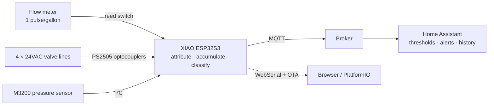

# Irrigation Leak Monitor

An ESP32-S3 that watches a single flow meter plumbed upstream of a four-zone irrigation valve
manifold, attributes every gallon to whichever valve is energised at the time, and reports
per-zone volume, flow rate, pressure and run time to Home Assistant over MQTT.

**Any flow measured while all four valves are off is a leaking valve.** That is the case this
device exists to catch.

[](https://deepwiki.com/heyitsyang/Irrigation-Leak-Monitor)

## Why

A stuck-open irrigation valve is close to invisible. It does not trip anything, it makes no
noise you would notice from indoors, and the first evidence is usually a water bill or a
permanently soggy patch of yard weeks later. A zone quietly running above its normal rate — a
cracked lateral, a sheared-off sprinkler head — is just as silent.

Both are obvious the moment somebody is actually counting gallons per zone. Nothing here is
clever; it just watches continuously and complains early.

## What it does

- **Per-zone accounting** — gallons, median GPM, peak GPM, average/min/max PSI, run duration.
- **Valve-leak detection** — flow with every valve off is reported as a fault, with an alert
  raised *mid-session* rather than waiting for the run to end (a stuck-open valve never stops
  flowing, so "the end of the run" may never arrive).
- **Water pressure and temperature** from an inline sensor, published on a 30-minute idle
  heartbeat and per zone during a run.
- **OTA updates** — the device is installed in an irrigation box; it is never on a USB cable
  again after the first flash.
- **WebSerial** — the full log is readable in a browser at `http://<device>/webserial`, for
  the same reason.
- **Two status LEDs** readable at a glance without a phone.

## Hardware at a glance

| Part | Detail |
|---|---|
| MCU board | Seeed Studio XIAO ESP32S3 |
| Flow meter | Hunter HC-100-FLOW, reed switch, 1 pulse per gallon |
| Pressure sensor | TE Connectivity `M32JM-000105-100PG`, 100 PSI gauge, I²C (optional) |
| Valve sensing | PS2505 optocouplers on the 24VAC valve lines |
| Power | Derived from the irrigation controller's 24VAC supply |

The single most important physical fact: **there is one flow meter, upstream of the entire
manifold** — not one per zone. Every design decision downstream follows from that.

## How it fits together



The firmware measures and reports; **Home Assistant decides**. For zones 1–4 the firmware
publishes a median GPM and HA compares it against a per-zone limit helper. Only the valves-off
leak case is classified on the device.

## Quick start

```bash
git clone https://github.com/heyitsyang/Irrigation-Leak-Monitor.git
cd Irrigation-Leak-Monitor
```

Create `include/credentials.h` — it is deliberately not in the repo:

```c
#define WIFI_SSID      "your-ssid"
#define WIFI_PASSWORD  "your-password"
#define MQTT_SERVER    "192.168.1.10"
#define MQTT_USER_NAME "mqtt-user"
#define MQTT_PASSWORD  "mqtt-password"
```

Build and flash over USB, then watch it come up:

```bash
pio run -e release_wCOM -t upload
pio device monitor -e release_wCOM
```

After the first flash, use `release_wOTA` and read the log at `http://<device-ip>/webserial`.
Full detail in [docs/building-and-flashing.md](docs/building-and-flashing.md).

## Documentation

| Document | Contents |
|---|---|
| [Hardware](docs/hardware.md) | Bill of materials, pinout, sensing circuits, plumbing topology |
| [Building and flashing](docs/building-and-flashing.md) | Toolchain, credentials, the four build environments, OTA |
| [Theory of operation](docs/theory-of-operation.md) | How measurement and classification actually work, and why |
| [MQTT contract](docs/mqtt-contract.md) | Every topic, payload and attribute; tunable parameters |
| [Home Assistant](docs/home-assistant.md) | Sensors, template sensors and automations, with YAML |
| [Troubleshooting](docs/troubleshooting.md) | Symptoms, causes, and the bench traps worth knowing |

## Status

Running in production on a four-zone system. The pressure sensor is optional — set
`PRESSURE_SENSOR_INSTALLED` to `0` in [src/main.cpp](src/main.cpp) and every pressure topic
reports the unavailable sentinel instead.
