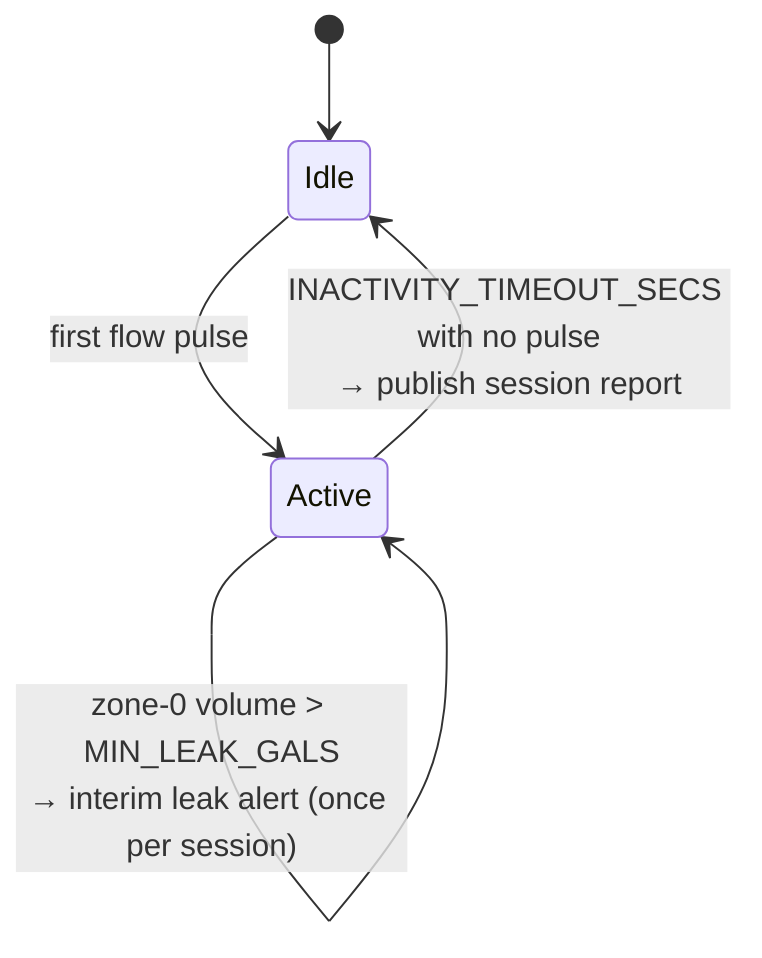

# Theory of operation

Each section states what the firmware does, then the failure it is avoiding. Most of these
decisions look arbitrary until you know what went wrong without them.

All of this lives in [src/main.cpp](../src/main.cpp).

## Session lifecycle

The device has no idea when the irrigation controller intends to run. It infers everything
from flow.



A **session** is one contiguous watering run, possibly spanning several zones. The first pulse
starts it and clears all accumulators; 90 seconds (`INACTIVITY_TIMEOUT_SECS`) without a pulse
ends it and publishes the report.

Between sessions the device publishes an idle heartbeat every 30 minutes (`HEARTBEAT_SECS`)
carrying pressure, temperature, and WiFi status, so a silent device is distinguishable from a
device with nothing to say.

## Valve attribution

With one meter upstream of the whole manifold, the meter cannot say where the water went. Each
pulse is credited to whichever valve is energised at that instant, via `getActiveValve()`.
Zone `0` means *no valve was energised* — flow that should not exist.

### The 24VAC problem

Valves are AC-driven, so the optocoupler output notches LOW at every mains zero crossing, 120
times a second. A single `digitalRead()` has a real chance of landing in a notch and reporting
"no valve active."

The consequence is not a mislabelled gallon. It is a gallon filed under **zone 0 — the leak
bucket**. Enough of those and the device reports a leak during perfectly normal irrigation.

So `getActiveValve()` polls repeatedly across `VALVE_AC_SAMPLE_MS` (25 ms, comfortably wider
than one 16.7 ms mains cycle at 60 Hz) and returns the first valve seen HIGH, only concluding
"no valve" after a full window with nothing:

```c
unsigned long sampleStart = millis();
do {
  if (digitalRead(VALVE_1_PIN) == HIGH) return(1);
  /* ... valves 2-4 ... */
  delay(1);
} while ((millis() - sampleStart) < VALVE_AC_SAMPLE_MS);
return(0);
```

The asymmetry is deliberate: any HIGH proves a valve is on, whereas any single LOW proves
nothing.

> This was the root cause of a false-positive leak problem that survived **two** earlier fix
> attempts aimed elsewhere. Its signature on the bench was valve readings that appeared to
> oscillate while the input was held steady — a beat frequency between the polling rate and
> the 120 Hz notches.

## Volume and rate are separate concerns

They come from the same pulses but behave differently, and conflating them caused several bugs.

**Volume** is recorded on every pulse, unconditionally, and **accumulates**:

```c
zoneData[valveThisFlowPulse].measuredZoneGallons += FLOW_GALS_PER_PULSE;
```

Accumulating rather than assigning matters when a zone is revisited within one session —
common when a controller runs a short second cycle. Assigning from a per-visit counter resets
the zone's total to 1 and silently discards everything measured earlier.

**Rate** is derived from the interval between consecutive pulses, so it needs *two* pulses in
the same zone visit to exist at all. The first pulse of a zone contributes gallons but no rate
sample.

That distinction is enforced by clearing `millisPrev` on every zone change. Without it, the
interval spanning the valve changeover — which measures the gap between zones, not flow through
either — becomes a rate sample. Observed values from that bug: **4 GPM from a 14-second gap,
and 94 GPM from a 637 ms one.**

## Why the rate is a median

Irrigation pipes start empty. Flow at the beginning of a run is much faster while the laterals
fill than once water is actually leaving the emitters. A mean over the whole run is dragged
upward by that spike.

The obvious fix — ignore the first N seconds — was tried and removed. A settle window has to be
tuned, it is wrong at a different flow rate, and worst of all a run *shorter* than the window
records nothing at all.

A **median** solves it structurally: the pipe-fill spike is a handful of samples at one end of
the distribution and the median steps over them. Nothing to tune, no sensitivity to flow rate,
and it works on runs of any length. It also shrugs off a dropped reed pulse, which doubles one
interval and halves that single sample — a mean absorbs that error permanently.

### Implemented as a histogram

Storing every sample would need unbounded memory for a long run. Instead samples are binned:
600 bins of 0.25 GPM covering 0–150 GPM, a fixed 1200 bytes. `medianGPM()` walks the bins to
the halfway count and returns the bin centre.

A ring buffer of recent pulses was the alternative and is worse: it quietly redefines "average
GPM for the run" as "average GPM recently," which is a different quantity wearing the same
name.

> **The histogram range must exceed any reading you can physically get.** Out-of-range samples
> clamp into the top bin and drag the median with them. An early 0–50 GPM range produced a
> constant 49.88 GPM during bench testing — the clamp value, not a measurement.

## Zone 0 is a fault condition, not a zone

Flow with all valves off is a leaking valve. It is reported through its own topic,
`irrig_leak/report/valve_leak`, and **deliberately does not appear in the per-zone series** —
there is no `median_gpm_zone_0` or `avg_psi_zone_0`. Treating a fault as a fifth zone invites
consumers to average it in with real ones.

### Classification is by volume alone

`zoneData[0].measuredZoneGallons > MIN_LEAK_GALS` (default 2 gallons). That is the whole test.

It works because of the plumbing: the meter is upstream of everything, so a closing valve stops
flow through it immediately and there is no legitimate bleed-down to excuse. Only a gallon or
two of transition noise while valves overlap. A stuck-open valve, by contrast, passes full zone
flow continuously. The two are orders of magnitude apart and volume separates them cleanly, so
no reasoning about rate is required.

An earlier version also required that *no* zone had run during the session before believing
zone-0 flow. That guard was removed: it dismissed all valves-off flow whenever a zone had run,
which is exactly the situation where a stuck valve is most likely and most invisible.

### Why the alert fires mid-session

`publishLeakTopic()` is called the moment volume crosses the threshold, once per session,
rather than waiting for the end-of-session report.

A stuck-open valve flows continuously. Continuous flow means the 90-second inactivity timeout
never fires, so the session never ends, so the report is never published — the worst failure
would go unreported for exactly as long as it persisted. The interim alert closes that hole.

### Gated state, ungated attribute

The `valve_leak` topic's **state** reads 0 below the threshold, so sub-threshold noise never
raises an alarm. Its `gallons` **attribute** always carries the true zone-0 volume.

That split keeps small transition volumes visible for tuning `MIN_LEAK_GALS` against real
observations, without those same volumes triggering notifications.

## Pressure and temperature

Both come from one 4-byte I²C read of the M3200: two status bits, a 14-bit pressure word, and
an 11-bit temperature word.

**Only data the sensor reports as good is converted.** The top two bits are status: `0` normal,
`2` stale, `3` fault. Stale simply means the read outpaced the sensor's ~2 ms conversion cycle,
so it retries. A fault will not clear by re-reading, so it breaks out immediately.

When the read fails for any reason, both values are set to `PRESSURE_SENSOR_INVALID` (`-99`).
This guard is essential rather than tidy: the values are file-scope globals, so without it a
*previous* call's reading would be returned and would look entirely plausible.

### The report is a synchronized snapshot

A report describes one session. Zones that did not run this session must not carry pressure
readings from a previous one.

`sendTotalsReport()` reads the sensor **once**, at the top, and every idle zone reports that
same "pressure at time of non-run" value. Not stale data, and not a fake `0.00` — which would
be indistinguishable from a real reading of zero. Zones that *did* run keep their own
per-zone averages, which is wanted: pressure varies with flow, so each zone has a
characteristic signature.

### Sentinel handling differs by topic

- **Idle topics** publish `-99` when the sensor is unavailable, so Home Assistant can detect
  and alert on sensor failure.
- **Session report topics skip the publish entirely.** Home Assistant has no way to distinguish
  `-99` from a real value in a history graph or a threshold comparison, so publishing it would
  corrupt long-term data. The retained previous value stands instead.

## Status LEDs

Driven by `updateLEDs()`, which is non-blocking and called from `loop()` **and from every
blocking wait** — the WiFi connect loop, the MQTT connect loop, and the reed-switch closure
wait. Miss one and the LEDs freeze there, which on a stuck reed switch means 90 seconds of
apparently-dead device.

| LED | State | Meaning |
|---|---|---|
| **Yellow** (active LOW) | fast blink, 100 ms | Connecting to WiFi |
| | slow blink, 500 ms | WiFi up, MQTT down |
| | solid | Both connected |
| **Blue** (active HIGH) | 500 ms blip | One flow pulse — one gallon |
| | rapid burst, 5 s | Session report being published |
| | dark | Idle |

Two details that are not obvious:

**Yellow derives its state live** from `WiFi.status()` and `mqttClient.connected()` on every
call, rather than from a cached flag. The previous implementation cached connection state and
updated it only at drop/connect events, so any transition the event handlers missed left the
LED asserting something untrue indefinitely.

**The blue flow blip is decoupled from the reed switch closure.** It is a fixed 500 ms one-shot,
not "lit while the contact is closed." Tying it to the closure would make the indicator's
visibility depend on the meter's magnet geometry — a brief contact would flash too fast to
catch reliably.

## Remote observability

There is no serial access once the device is installed. Everything therefore goes through
`LOG()`, which mirrors to both `Serial` and WebSerial.

Because WiFi comes up well after boot, early log output would otherwise be lost. `LOG()`
captures into a 2 KB buffer until a WebSerial client first attaches, then replays it — so boot
diagnostics survive to be read hours later.

Sending any character to the WebSerial page prints a status line with a **live** pressure and
temperature reading. That exists because the per-pulse log only fires when the reed switch
trips, which is no help at all for a static reading such as a zero-pressure check, and the idle
heartbeat is on a 30-minute timer.
